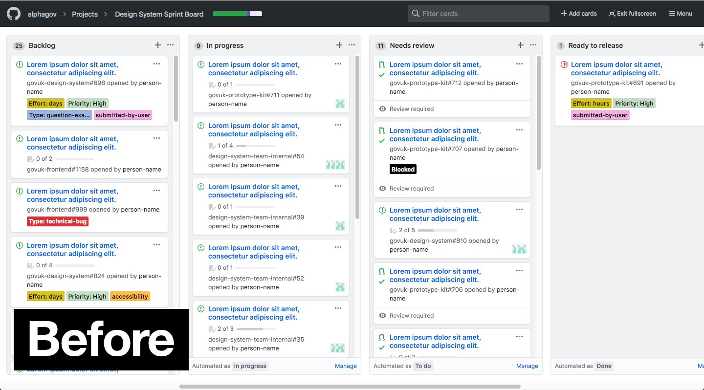
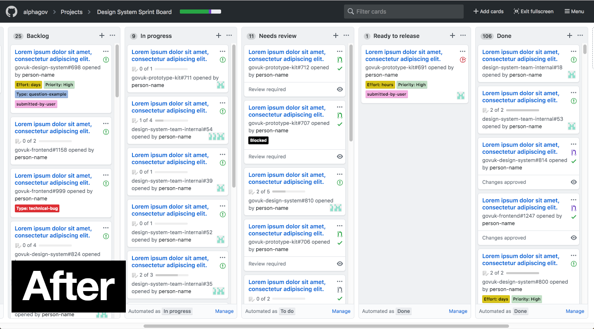

# GitHub Projects Fullscreen Compressed

Compresses the columns and UI when in fullscreen mode for GitHub projects to allow for more room.

## Screenshots

---

## Install

I can't be arsed to put it on the Chrome Webstore, unless people want me to

1. Download [github-projects-fullscreen-compressed.crx](github-projects-fullscreen-compressed.crx)
2. Copy `chrome://extensions/` and paste it in your address bar (URL)
3. Turn the 'Developer mode' on the top right
4. Drag and drop the downloaded `github-projects-fullscreen-compressed.crx` file